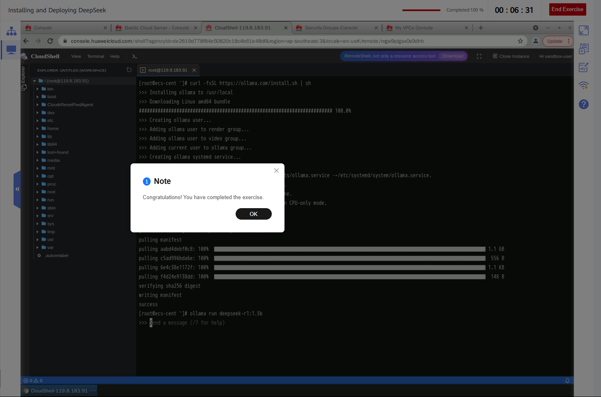
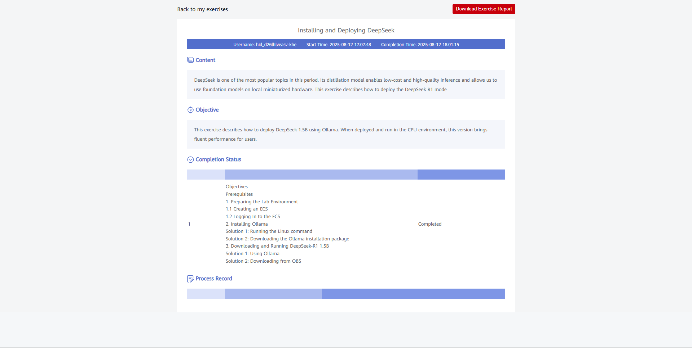

# ☁️ Huawei Cloud AI Bootcamp – Installing and Deploying DeepSeek R1 1.5B

Bu repo, Huawei Cloud AI Bootcamp kapsamında gerçekleştirilen **DeepSeek R1 1.5B modelinin kurulumu ve dağıtımı** lab çalışmasının özetini içerir.  
Amaç, Huawei Cloud üzerinde bir ECS (Elastic Cloud Server) oluşturarak Ollama aracı ile DeepSeek modelini kurmak, çalıştırmak ve gerçek zamanlı test etmektir.  

---

## 📘 Lab Özeti  

Bu çalışmada, Huawei Cloud üzerinde bir ECS örneği oluşturularak DeepSeek R1 1.5B modeli başarıyla deploy edildi. Kurulum sürecinde Ollama aracı kullanıldı ve model hem GitHub’dan çekilerek hem de OBS üzerinden indirilen yedek paket ile çalıştırıldı.  

### 🔹 Adımlar  

- **ECS Oluşturma:**  
  - AP-Singapore bölgesinde CentOS 8.2 (40 GiB) tabanlı, 4 vCPU ve 8 GiB bellekli bir ECS örneği oluşturuldu.  
  - Ağ (VPC, güvenlik grubu) ve EIP ayarları yapıldı, 100 Mbps bant genişliği ile model indirme hızının artırılması sağlandı.  

- **Ollama Kurulumu:**  
  - Çözüm 1: GitHub’dan script ile indirme (`curl -fsSL https://ollama.com/install.sh | sh`).  
  - Çözüm 2: OBS üzerinden hızlı indirme (`ollama-linux-amd64.tgz`), systemd servisi olarak Ollama başlatıldı.  
  - Servis ayarları yapıldı, `ollama -v` komutu ile başarıyla çalıştığı doğrulandı.  

- **DeepSeek Modelini Yükleme ve Çalıştırma:**  
  - Çözüm 1: `ollama pull deepseek-r1:1.5b` ile modelin topluluk sürümü çekildi.  
  - Çözüm 2: OBS’den yedek model dosyası indirildi (`ollama_deepseek_r1_1.5b.tar.gz`) ve Ollama’nın model klasörüne yerleştirildi.  
  - `ollama run deepseek-r1:1.5b` komutu ile model başarıyla çalıştırıldı ve test diyalogları gerçekleştirildi.  

---

## 🔹 Kazanımlar  

- Huawei Cloud üzerinde **ECS hazırlama ve konfigürasyon**  
- **Ollama** aracıyla LLM kurma ve servis olarak çalıştırma  
- **OBS üzerinden model dağıtımı** ve alternatif indirme yöntemleri  
- **DeepSeek R1 1.5B modelini çalıştırma** ve etkileşimli testler  

---

## 📷 Görseller  

- ECS üzerinde çalışan DeepSeek servisinin ekran görüntüsü:  
    

- Lab raporu ekranı:  
    

---

## 📌 Not  
Bu proje, Huawei Cloud AI Bootcamp kapsamında gerçekleştirilen **Compute (ECS) odaklı lab** çalışmasının özetidir. Amaç, bulut üzerinde büyük dil modellerinin düşük maliyetli şekilde kurulumu ve deploy edilmesini deneyimlemektir.  
